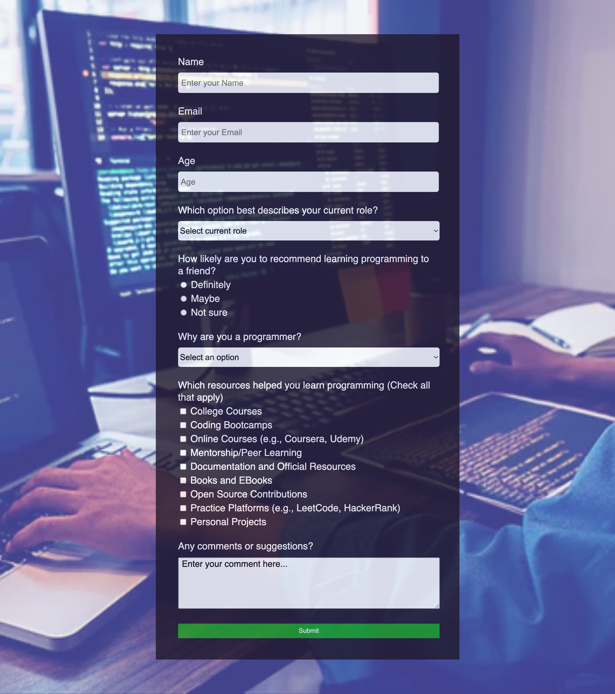

<h1 align="center">
Survey Form 
</h1>

A generic survey form utilizing intermediate HTML and CSS principles

<h2 align="center">
Survey Form 
</h2>

# Objective

- Build a survey form

## Development Notes:

- No external libraries were used.
- The background image is a stock image
